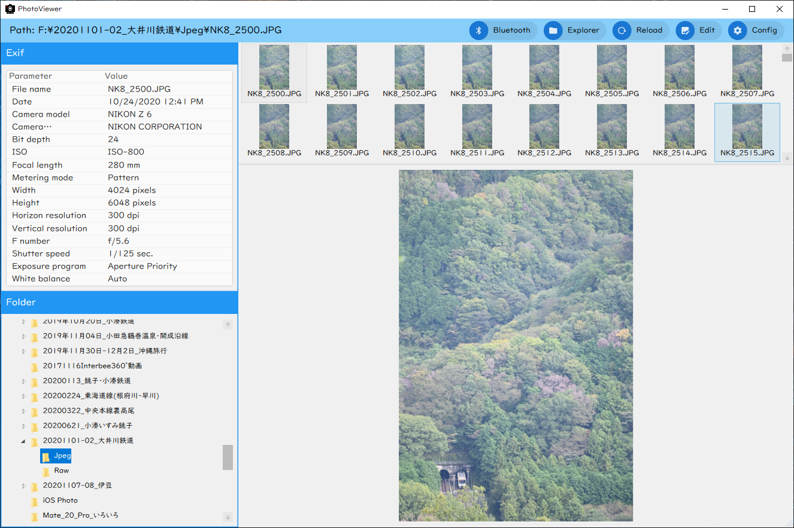

# PhotoViewer
## 免責事項
このソフトは無保証・無責任です。以下の条件に同意していただける場合にのみ、このソフトをご利用いただくことができます。

- 作者は、このソフトによって発生した損害に関し、一切の責任を負わない。

- 作者は、このソフトのサポート ( 不具合修正・バージョンアップなど ) に関する一切の義務を負わない。

## アプリ概要
Windows用のPhotoViewerです。Exif情報や写真閲覧が可能です。

Windows 10 1903以降の対応で、Raw 画像拡張機能、NikonのNEF Codecのインストールが必須です。

- https://www.microsoft.com/ja-jp/p/raw-%E7%94%BB%E5%83%8F%E6%8B%A1%E5%BC%B5%E6%A9%9F%E8%83%BD/9nctdw2w1bh8?activetab=pivot:overviewtab
- https://downloadcenter.nikonimglib.com/ja/products/170/NEF_Codec.html

## アプリの動作
Exif情報や写真の閲覧ができます。

Exif情報の削除し、ブログ向け、SNS向けにファイルサイズを変更して保存できます。

設定画面で設定した他のアプリを起動することも可能です。

## ビルドについて
本アプリは、vcpkgにて、OpenCV、Librawの64bitのライブラリがインストールされている環境でのみビルド可能です。

vcpkgは、以下のURLを参考にインストールしてください。

https://docs.microsoft.com/ja-jp/cpp/build/vcpkg?view=msvc-160

次に、以下のコマンドを打ち、OpenCVとLibrawのライブラリをビルドしてください。

`vcpkg install opencv:x64-windows libraw:x64-windows`

その後、以下のコマンドを打ち、Visual studioのプロジェクトにvcpkgを適用してください。

`vcpkg integrate install`

## 使用しているライブラリ
- Prism.Wpf

- ReactiveProperty

- System.Drawing.Common

- VirtualizingWrapPanel

- OpenCV

- MaterialDesignThemes.MahApps

- MetadataExtractor

- Libraw
  このアプリは、Libraw オープン ソース プロジェクト (http://www.libraw.org) に基づいて機能します。Libraw ライブラリは、COMMON DEVELOPMENT AND THIS DISTRIBUTION LICENSE Version   1.0 (CDDL-1.0) に基づいてライセンスされます。

## 機能
- 写真閲覧

- Exif情報の閲覧

- 連携アプリの起動（設定画面で設定が必要）

## クレジット
- kchary @kleon6436 (Author, Developer)

This software is released under the MIT License, see LICENSE.txt.

The license for this app was licensed by kleon6436 and not presented by the developers of Libraw.
